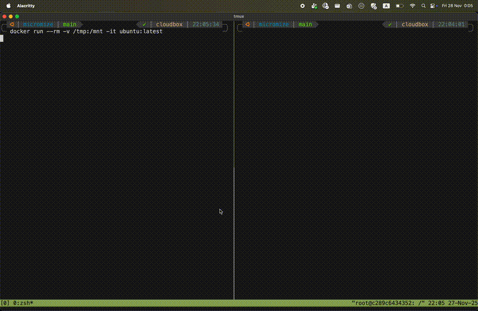

<h1>
  <picture>
    <source media="(prefers-color-scheme: light)" srcset="docs/images/logo/logo-horizontal.svg">
    
  </picture>
</h1>

`micromize` is a security hardening tool designed to reduce the visible kernel surface for containerized applications by leveraging [BPF LSM](https://docs.ebpf.io/linux/program-type/BPF_PROG_TYPE_LSM/).

This project is currently experimental. Features and APIs are subject to change. Use with caution in production environments.



## Overview

The core philosophy of `micromize` is simple: **Instant hardening by default.**

Traditional container security often involves creating complex profiles (like Seccomp or SELinux) for each application to restrict its capabilities. `micromize` flips this model. Instead of defining what each container *can* do, `micromize` applies a broad set of sensible restrictions to *all* containers running on a node, blocking dangerous kernel control flows that are rarely needed by legitimate containerized workloads and often used for container escapes.

By deploying `micromize` to your nodes, you instantly harden the entire node. You then manage **exclusions** for specific workloads that require broader permissions, rather than managing restriction profiles for everyone else.

`micromize` is built on [Inspektor Gadget](https://github.com/inspektor-gadget/inspektor-gadget) and employs the "gadget mindset", creating a modular architecture to load and execute eBPF programs.

### Prerequisites

- Linux kernel with BPF LSM support (5.7+ recommended).

### Running

`micromize` can run in two modes: **Enforce** (blocking) and **Audit** (logging only).

To run in **Enforce mode** (default):
```bash
sudo dist/micromize-linux-[amd64|arm64] -enforce=true
```
This will block restricted actions and log the events.

To run in **Audit mode**:
```bash
sudo dist/micromize-linux-[amd64|arm64] -enforce=false
```
This will only log the events without blocking them, which is useful for testing and discovering what permissions your workloads need.

By default, `micromize` is set to enforce mode.

### Output

`micromize` outputs events in JSON format to stdout. Each event represents a restricted action that was attempted (and potentially blocked).

Example output:
```json
{"filename":"/mnt/ls","k8s":{"containerName":"","hostnetwork":false,"namespace":"","node":"","owner":{"kind":"","name":""},"podLabels":"","podName":""},"process":{"comm":"nope\n","creds":{"gid":0,"uid":0},"mntns_id":4026532763,"parent":{"comm":"nope\n","pid":2855519},"pid":2855685,"tid":2855685},"runtime":{"containerId":"a60a9c1bfe276bb228edc5b69799e93f81ad22b48df38352a61a4dab979de15a","containerImageDigest":"sha256:80dd3c3b9c6cecb9f1667e9290b3bc61b78c2678c02cbdae5f0fea92cc6734ab","containerImageName":"ubuntu:latest","containerName":"angry_satoshi","containerPid":2855519,"containerStartedAt":1764281145433600315,"runtimeName":"docker"},"timestamp_raw":5666551227589565}
```

### Building

In order to build `micromize` gadgets, you need [`ig`](https://inspektor-gadget.io/docs/latest/quick-start#linux) installed.

```bash
make build-all
```

